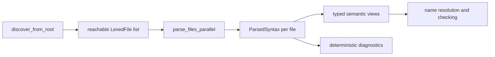

# Parser Design Proposal

Date: 2026-05-22

## Status

Draft for review.

This document proposes the parser design for the Wrela command center. It does
not implement the parser, change locked decisions, or replace the existing
import-summary parser used by source discovery.

## Purpose

The parser should turn each reachable `LexedFile` into an immutable, spanned
syntax artifact that later compiler phases can consume without reparsing token
streams. It should keep the repository's current shape:

- handwritten Rust, no external crates
- diagnostics returned as data
- immutable phase artifacts
- per-file local work that can run in parallel
- deterministic merge order
- root-driven discovery through `use { ... } from module.path`

The parser is the next major phase after lexer and import-summary discovery. It
should establish the complete source structure that name resolution, type
checking, ownership checking, effect inference, formatting, refactoring, and
later lowering can build on.

## Recommendation

Build a handwritten recursive-descent parser with a lossless concrete syntax
tree (CST) builder. Use Pratt parsing for expression structure, but preserve
every token, trivia item, delimiter, and recovery error node inside the parsed
syntax artifact.

The CST should be the durable production foundation. Semantic compiler phases
can consume typed views or a compact derived AST lowered from the CST, but the
first parse should not discard source structure that formatting, diagnostics,
refactoring, editor support, and precise recovery will need later.

## Resolved Design Choices

The first parser should target the broad language shape: declarations, type
syntax, blocks, statements, and expressions. Semantic validation remains out of
scope for the parser, but the CST should know the whole source shape from the
start.

Trivia should attach to token elements as leading or trailing trivia. `LexedFile`
remains the raw token and trivia source, and the CST token element records the
token plus the trivia ranges attached to it. This keeps ordinary tree walks from
seeing trivia as peer syntax while preserving exact source reconstruction.

Import binder aliases are out of v1. The accepted import form remains explicit
imported names:

```wrela
use { Name, Other } from module.path
```

No wildcard imports and no `as` aliases are part of the first full parser.

The first parser-facing CLI should be `wrela parse <root.wrela>`. It should be
a read-only phase inspection command, like today's `lex` and `dump tokens`
commands. `wrela check` should wait until parsing is paired with semantic
checks that can make a real correctness promise.

## Alternatives Considered

### CST-First Parser

The parser consumes tokens and trivia and returns a concrete tree with syntax
node kinds, token elements with attached trivia, spans, and error nodes.
Semantic views such as `Module`, `Item`, `ClassDecl`, `Stmt`, `Expr`, and
`TypeRef` are derived from that tree.

Pros:

- strongest foundation for production diagnostics and recovery
- preserves exact source structure for formatting and refactoring
- keeps comments and doc comments attached to syntax instead of requiring later
  reconstruction
- naturally parallel by file
- avoids reparsing when later tooling needs more source detail

Cons:

- larger initial design surface than an AST-only parser
- more memory than a compact semantic AST
- requires a disciplined tree representation before later phases exist

This is the recommended approach.

### Typed AST-First Parser

The parser consumes tokens and returns strongly typed semantic nodes directly.

Pros:

- smallest initial compiler-facing artifact
- easy for name resolution and checking to consume
- less tree infrastructure

Cons:

- discards production-significant source structure too early
- makes formatting, refactoring, doc attachment, and rich recovery harder
- risks a second parser or CST retrofit later

This should be deferred as a derived view over the CST.

### Event-Only Parser With Later Tree Construction

The parser emits start-node, token, error, and finish-node events, and a later
builder turns events into a tree or AST.

Pros:

- can support CST and AST construction from one parser
- useful when parser recovery and tree construction need to evolve separately

Cons:

- more moving parts if events remain the public parser artifact
- postpones direct inspection of the concrete syntax tree

The implementation may use events internally, but the public parser artifact
should be the completed CST.

## Pipeline Placement

The import-summary parser remains the discovery parser. Full parsing starts
after discovery has loaded and lexed the reachable graph.



Discovery keeps using `syntax::imports::parse_import_summary` because it only
needs import edges and must run while the reachable graph is still expanding.
The full parser parses imports again into the CST. That duplication is
intentional: discovery stays cheap and tolerant, while full parsing owns the
complete source shape and later import validation.

## Public API Shape

Add parser APIs under `src/syntax/`:

```rust
pub fn syntax::parse_file(lexed: &LexedFile, source: &SourceFile) -> ParsedSyntax;
pub fn syntax::parse_files_parallel(
    lexed_files: &[LexedFile],
    source_map: &SourceMap,
) -> Vec<ParsedSyntax>;
```

Proposed artifact:

```rust
pub struct ParsedSyntax {
    file_id: FileId,
    tree: SyntaxTree,
    diagnostics: Vec<Diagnostic>,
}
```

`SyntaxTree` should contain a root module node and enough element information to
walk all child nodes, token elements, and parser-inserted error nodes in source
order. Token elements should carry leading and trailing trivia ranges. The tree
should store spans and token/trivia indices rather than copied source text.

`parse_files_parallel` should return syntax artifacts sorted by `FileId`,
independent of thread completion order. It can use `std::thread::scope`, matching
`lex_files_parallel`.

## Module Layout

Suggested source layout:

```text
src/syntax/
  mod.rs
  imports.rs
  parse.rs
  cst.rs
  syntax_kind.rs
  lower.rs
  expr.rs
  types.rs
  recovery.rs
```

The exact split can change during implementation, but the boundaries should stay
clear:

- `imports.rs`: discovery-only import summary parser
- `parse.rs`: parser driver and token cursor
- `cst.rs`: syntax tree storage and element walking
- `syntax_kind.rs`: node, token, trivia attachment, and error-node kind enums
- `lower.rs`: typed semantic views derived from CST nodes
- `expr.rs`: Pratt expression parsing helpers
- `types.rs`: type and generic syntax helpers
- `recovery.rs`: synchronization predicates and delimiter recovery helpers

If the implementation stays small at first, `expr.rs`, `types.rs`, and
`recovery.rs` can begin as private modules or private sections and split later.
`lower.rs` can start with only the typed views needed by tests and future
semantic summaries.

## CST Principles

The CST stores source structure and spans, not copied source text. Identifier,
literal, operator, keyword, and delimiter elements carry spans back into
`SourceFile`; trivia is attached to token elements as leading or trailing
trivia ranges.

For example:

```rust
pub struct SyntaxTree {
    file_id: FileId,
    root: SyntaxNodeId,
    nodes: Vec<SyntaxNode>,
    elements: Vec<SyntaxElement>,
    tokens: Vec<SyntaxToken>,
}

pub enum SyntaxElement {
    Node(SyntaxNodeId),
    Token(SyntaxTokenId),
    Error(SyntaxErrorNode),
}

pub struct SyntaxToken {
    token: TokenIndex,
    leading_trivia: TriviaRange,
    trailing_trivia: TriviaRange,
}

pub struct SyntaxErrorNode {
    kind: SyntaxErrorKind,
    span: Span,
}
```

The CST should be lossless with respect to the lexed source. Walking the tree in
source order, then reading token spans and attached trivia spans from
`SourceFile`, should be enough to reconstruct the original source text. The CST
may refer to `LexedFile` token and trivia indices instead of copying those
values.

Semantic summaries can copy or intern names later when they need cross-file
maps. The CST itself should avoid owning strings except for diagnostic messages
inside parser error nodes if that proves necessary. The initial parser can keep
string and integer literals as spans.

Every syntax node should expose a span covering its concrete source range,
including delimiters when present. Missing syntax should appear as an error node
or missing marker attached at the point where the grammar expected it.
Diagnostics should point at the current token when possible, otherwise at a
narrow anchor span near the construct that expected the missing token.

Malformed syntax should be represented explicitly enough that later phases can
skip it without panicking. Use error nodes and missing markers in the CST rather
than dropping malformed token ranges.

## Initial Grammar Scope

The first full parser should parse the language shape described in
`2026-05-22-wrela-language-and-test-design.md`, while keeping semantic
validation out of the parser. It should not stop at declarations; blocks,
statements, and expressions are part of the initial CST contract.

Top-level syntax:

- optional `module` declaration
- `use { Name, Other } from module.path`
- `pub` item modifier
- `data`
- `layout ... data`
- `class`
- `unique class`
- `interface`
- `error`
- `image ... target ...`
- `host image`

Class and interface syntax:

- fields: `name: Type`
- methods: optional `asm`, `fn name(params) -> Type`
- constructors: `constructor(params)` with optional return type
- interface method signatures without bodies
- `implements InterfaceName`
- generic parameters such as `<T: Constraint>`
- `test "name" { ... }` declarations inside classes

Type syntax:

- plain names and dotted names
- generic arguments with brackets, such as `Result[Header, HeaderError]`
- access-qualified types: `read T`, `mut T`, `own T`, `unique T`
- const arguments inside type positions, such as `Table[Session, 4096]`

Statement syntax:

- `let` bindings with optional type annotations
- `return`
- `match`
- `repeat`
- table-row `for`
- `drain`
- `loop`
- `assert value`
- `assert same`
- expression statements

Expression syntax:

- names, literals, `Self`, `None`, `true`, `false`
- calls and named arguments
- field access and indexing
- unary operators and access operators
- binary operators by precedence
- `try` and `try ... else return ...`
- constructor-like expressions such as `Header(version = 1)`

The parser should accept semicolons as optional statement separators only where
the grammar explicitly allows them. Wrela examples mostly use newline-separated
statements, but newlines are trivia today, so block parsing must rely on
expression and statement boundaries rather than newline tokens. The expression
parser should stop when the next token cannot continue the current expression
and the enclosing statement or block parser can accept a new statement. This
keeps parsing mode-free and avoids making newline trivia semantic.

## Lexer Gaps To Resolve Before Full Expression Parsing

The current lexer is enough for imports and many declaration examples. The full
parser will expose a few token gaps from the language design:

- range patterns such as `2..=15`
- the exact treatment of built-in values such as `true`, `false`, `None`, and
  `Self`, which currently can be recognized by identifier text if they stay out
  of the keyword enum
- any future declaration or operator syntax not represented by `Punct`

The parser implementation plan should include a small lexer-extension task
before expression and pattern parsing if the accepted grammar keeps those forms.
This is not a parser dependency decision; it stays within the zero-dependency
lexer.

## Parsing Strategy

Use one `Parser` per file:

```rust
struct Parser<'a> {
    source: &'a SourceFile,
    lexed: &'a LexedFile,
    tokens: &'a [Token],
    index: usize,
    builder: SyntaxTreeBuilder,
    diagnostics: Vec<Diagnostic>,
}
```

The parser should provide small cursor helpers:

- `peek`
- `at`
- `bump`
- `eat`
- `expect`
- `expect_keyword`
- `expect_punct`
- `recover_until`

Recursive descent should handle declarations, members, statements, types, and
patterns. Expression parsing should use Pratt precedence so the grammar can add
operators without turning expression parsing into a long cascade of mutually
recursive functions.

Each parser function should open a syntax node, consume tokens and trivia into
the builder, attach leading/trailing trivia to token elements, insert error
nodes for missing or malformed syntax, then close the node with a stable
`SyntaxKind`. This keeps grammar code close to the source language while still
producing a complete concrete tree.

Do not make parsing depend on name resolution. The parser should accept
syntactically valid references even when the name is undefined, private, the
wrong kind, or semantically invalid.

## Error Recovery

Parser diagnostics should be recoverable. A syntax error in one member should
not suppress parsing of the next top-level declaration.

Use synchronization sets at natural boundaries:

- top-level items: `use`, `module`, `pub`, `data`, `layout`, `class`,
  `unique`, `interface`, `error`, `image`, `host`, EOF
- class members: `constructor`, `fn`, `asm`, `test`, identifier fields,
  closing brace
- statements: `let`, `return`, `match`, `repeat`, `for`, `drain`, `loop`,
  `assert`, `try`, closing brace
- delimiters: matching `)`, `]`, and `}` should be preferred over global
  skipping

Recovery should preserve delimiter nesting and place skipped tokens in the CST
under an error node. For example, a bad expression inside a call should try to
recover at `,` or `)` before skipping to the next statement.

The parser should avoid duplicating lexer diagnostics. If a token is
`TokenKind::Unknown`, the lexer has already reported the unknown character.
Parser errors caused by that token can report the missing syntactic expectation
only when that helps recovery.

## Diagnostics

Diagnostics remain plain `Diagnostic` values. The parser should not print.

Initial parser messages should be compact and stable enough for tests:

- `expected item`
- `expected identifier`
- `expected type`
- `expected expression`
- `expected ')'`
- `expected '}'`
- `unexpected token in class body`
- `unexpected token in statement`

Later diagnostic rendering can use `SourceMap` line information, but parser
diagnostics should already carry precise spans.

## Determinism And Parallelism

Parsing is file-local. It should not need global mutable compiler state, module
graphs, or cross-file symbol tables.

Parallel parse batches should:

1. receive immutable `LexedFile` and `SourceFile` inputs
2. parse each file independently
3. return `ParsedSyntax` artifacts
4. sort by `FileId`
5. merge diagnostics by file ID, then source span

This mirrors the lexer and keeps later replacement with a worker pool possible.

## Relationship To Imports

The current `ImportSummary` should continue to use its own narrow parser during
discovery. The full CST should still contain `UseDecl` syntax nodes, and the
typed import view derived from those nodes should validate imported binders,
visibility, and unused imports.

The two import parsers must agree on module path syntax:

- dotted identifiers only
- no slash separators
- no absolute paths
- no `..`
- no file extension segment

If the full parser expands import binder syntax, the discovery parser should
only grow when that syntax affects the ability to find module paths.

Aliases are intentionally not part of v1 import syntax. If aliases are added
later, they should be accepted by a focused design update after name resolution
has real conflict cases to evaluate.

## Testing Strategy

Parser tests should follow the current public-API style.

Unit tests:

- parser cursor helpers
- syntax tree builder invariants
- source reconstruction from CST token order and attached trivia
- expression precedence
- delimiter recovery
- top-level item recovery
- type syntax
- import path agreement with `parse_import_summary`

Integration fixtures:

- a minimal root image
- data and layout declarations
- interfaces and classes
- constructors and methods
- match and loop shapes
- test suite declarations
- syntax errors with recovery after the bad construct

The quality gate remains:

```bash
./scripts/quality-gate.sh
```

## Rollout Plan For A Later Implementation

1. Add `SyntaxKind`, `SyntaxTree`, `SyntaxElement`, and `ParsedSyntax`.
2. Add parser cursor, syntax tree builder, and top-level item parsing.
3. Parse imports and module declarations into the CST, then compare import
   behavior with the existing discovery parser.
4. Parse type syntax and generic parameter lists.
5. Parse data, layout data, interface, class, constructor, method, and test
   declarations.
6. Add statements and block recovery.
7. Add Pratt expression parsing.
8. Add typed semantic views lowered from CST nodes for the next compiler phase.
9. Add `parse_files_parallel`.
10. Wire a read-only `wrela parse <root.wrela>` CLI surface that discovers,
   lexes, parses, reports summaries, and exits 1 on errors.
11. Update `supported-wrela-subset.md`, `compiler-pipeline.md`, and
    `locked-decisions.md` after implementation decisions are accepted.

## Proposed Locked Decisions After Acceptance

If this proposal is accepted, add parser decisions to
`docs/design/locked-decisions.md` during the implementation plan:

- The first full parser is handwritten recursive descent with Pratt expression
  parsing.
- The first parser targets broad source shape: declarations, types, blocks,
  statements, and expressions.
- The parser produces a lossless CST with syntax nodes, token elements carrying
  attached trivia, and parser error nodes.
- Typed semantic views are derived from the CST instead of replacing it.
- `LexedFile` remains the token and trivia source consumed by the CST builder.
- V1 imports accept explicit imported names only; aliases and wildcards are out
  of scope.
- `wrela parse <root.wrela>` is the initial parser CLI surface.
- Full parsing is per-file local work and may run in parallel across files.
- Parser diagnostics are returned as data and merged deterministically.
- The discovery import-summary parser remains separate from full parsing.
