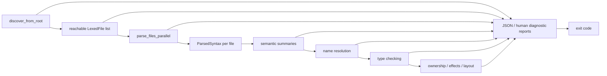

# Check And Diagnostics Design

Date: 2026-05-25

## Status

Draft for review.

This document proposes the first full semantic checking boundary for the Wrela
command center. It does not implement `wrela check`, change locked decisions,
design MIR lowering, or design canonical formatting.

## Purpose

After the CST parser lands, Wrela needs one compiler phase that can make a real
correctness promise for the parser-supported language subset. That phase should
also become Wrela's first real product surface: the product is incredible
diagnostics.

The preferred boundary is a single `wrela check <root.wrela>` command that
understands the reachable Wrela program deeply enough to explain what is wrong,
where it happened, why it matters, and how to move forward.

The design includes:

- semantic summaries and HIR-like typed views derived from the CST
- name resolution and symbol validation
- type checking
- ownership, effect, and layout legality checks for the supported subset
- permissive error recovery that keeps collecting useful diagnostics after the
  first failure
- rich, structured diagnostics with source context, related spans, and
  suggested fixes
- stable machine-readable JSON output as the default `check` renderer

Canonical formatting should be a later design. The parser and diagnostic model
should preserve trivia and source structure so `wrela fmt` can be excellent
later, but `wrela check` should not rewrite source in this design.

MIR lowering should also come later. It should consume resolved, typed, and
validated semantic artifacts rather than carrying unresolved names, unknown
types, or unchecked ownership and layout facts forward.

## Recommendation

Implement `wrela check <root.wrela>` as the first complete semantic gate and
diagnostic product surface for the language subset that the parser supports.

`check` should be intentionally stronger than a parser inspection command:

1. Discover reachable files from the root.
2. Lex and parse every reachable file.
3. Build semantic summaries and HIR-like typed views from the CST.
4. Resolve imports, names, type references, and member references.
5. Type-check declarations, signatures, statements, and expressions.
6. Run ownership, effect, and layout legality checks for the supported subset.
7. Keep recovering and collecting useful diagnostics after failures whenever
   later diagnostics would still be trustworthy.
8. Emit high-quality diagnostics for all collected errors, warnings, notes, and
   suggestions. JSON is the default output; human text is available through an
   explicit flag.
9. Exit 0 only when checking succeeds without error diagnostics.

`check` is read-only. It may compute suggestions and source edits as diagnostic
data, but it must not rewrite files.

## Command Contract

The initial CLI surface should be:

```text
wrela check <root.wrela>
wrela check --json <root.wrela>
wrela check --human <root.wrela>
```

`wrela check <root.wrela>` and `wrela check --json <root.wrela>` both emit the
stable JSON representation. `--json` exists for scripts and agents that prefer
explicitness even though JSON is already the default. `wrela check --human
<root.wrela>` emits the rich text renderer.

For valid code:

- all reachable `.wrela` files are checked
- no source files are rewritten
- JSON output includes `"ok": true`, source file metadata, and an empty
  diagnostic list
- human output may summarize checked files
- the command exits 0

For invalid code:

- diagnostics are emitted in the selected output format
- no source files are rewritten
- the command exits 1 for lexing, parsing, semantic, or internal diagnostic
  rendering errors
- malformed command usage still exits 2, matching existing CLI behavior

The default successful JSON shape should be stable and compact:

```json
{
  "schema": "wrela.check.v1",
  "ok": true,
  "checkedFileCount": 4,
  "sourceFiles": [],
  "diagnostics": []
}
```

Only `command.rs` should print user-facing output. Compiler phases should return
diagnostics as immutable data.

## Staged Delivery

This design is one product boundary, not one tiny implementation task.

The implementation plan should stage the work internally while preserving the
stable `wrela check <root.wrela>` command contract. Stages may introduce
diagnostic infrastructure, semantic summaries, name resolution, type checking,
ownership/effect/layout checks, and rendered diagnostic examples in reviewable
steps.

Unsupported semantic areas should not silently pass. Until a checker area is
implemented for a parsed construct, `check` should emit an explicit unsupported
semantic diagnostic for that construct or keep the construct outside the parser
supported subset. No placeholder semantics should pretend that unchecked code is
valid.

## Pipeline Placement

The full check pipeline starts after root-driven discovery and full parsing.



Diagnostics from earlier phases should remain visible even when later phases
cannot run for the affected construct. Later phases should continue over
independent files, modules, items, and bodies whenever recovery data makes that
trustworthy.

## Semantic Artifacts

The checker should derive semantic artifacts from the CST rather than replacing
the CST as the durable source artifact.

Suggested artifacts:

- `CheckResult`: source map, parsed files, diagnostics, summaries, and semantic
  artifacts produced before any unrecoverable failure
- `ModuleSummary`: module declaration, imports, top-level declarations, and
  exported names for one source file
- `ItemSummary`: data, layout data, interface, class, image, method, constructor,
  phase, and test declarations supported by the parser
- `SignatureSummary`: parameters, access qualifiers, generic parameters,
  return types, effects, and declared layout facts
- `ResolvedGraph`: module imports, symbol tables, resolved paths, and duplicate
  or missing-name diagnostics
- `TypedProgram`: resolved expression and statement types for supported bodies
- `SemanticFacts`: ownership, effect, and layout facts needed before lowering
- `DiagnosticReport`: structured diagnostic data with primary spans, secondary
  spans, notes, help text, related locations, and suggested source edits

Names may need to be copied, owned, or interned in semantic summaries because
they cross file and phase boundaries. The first implementation plan should make
that ownership choice explicitly. Until then, this design only requires that
semantic artifacts own enough name data to outlive temporary CST traversals and
that spans continue to point back into `SourceFile` for diagnostics.

## Name Resolution

Name resolution should validate the graph that discovery only approximates.

It should:

- validate explicit import binders against the imported module's exports
- reject duplicate local declarations and duplicate imported names
- build stable symbol tables in deterministic order
- resolve module paths, item paths, type references, member references, and
  constructor references
- distinguish wrong-kind references, such as using a method as a type
- report unresolved names without stopping later independent checks where
  recovery is practical

Discovery still uses the narrow import-summary parser. Semantic name resolution
owns full import validation after parsing all reachable modules.

## Type Checking

The first `check` design includes expression and body type checking for the
parser-supported language subset, not only declaration-level validation.

It should:

- check fields, parameters, return types, and generic constraints
- type-check let bindings, returns, blocks, calls, constructors, member access,
  indexing, matches, loops, `try`, and assertions where parsed
- reject semantically invalid comparison chains such as `a == b == c`
- ensure function, method, constructor, phase, and test bodies match their
  signatures
- produce diagnostics as data and recover enough to continue checking
  independent items

Unsupported language constructs should remain parser errors or explicit
semantic diagnostics. The checker should not silently accept syntax whose
semantics are not implemented.

## Ownership, Effects, And Layout

The first `check` design includes the Wrela-specific semantic checks needed
before MIR lowering can be trusted.

It should:

- enforce `read`, `mut`, and `own` access rules for supported declarations and
  calls
- detect invalid moves, consumes, mutations, and aliases for supported bodies
- validate `unique` class authority facts that are represented in the parsed
  subset
- infer and check supported effect facts
- validate supported layout data and ABI-relevant layout constraints
- keep dev-mode semantics strict; later release work may add stronger reports
  but not weaker semantic rules

If any area needs to start with a smaller supported subset, the implementation
plan should name that subset and emit explicit diagnostics for unsupported
cases.

## Diagnostic Product Bar

`wrela check` should be the compiler's diagnostic showcase. It has the CST,
source map, semantic summaries, resolved graph, typed program, and ownership,
effect, and layout facts all in hand. It should use that context to produce
diagnostics that are precise, calm, actionable, and useful to both humans and
agents.

Diagnostics are not incidental output from `check`; they are the primary product
experience for the first semantic Wrela release.

The diagnostic goal is not just "point at the bad token." The goal is to explain:

- what failed
- where the main failure is
- which related source locations caused it
- what Wrela expected instead
- whether the compiler can suggest a safe fix
- what semantic rule is being protected

The implementation plan should treat diagnostic quality as acceptance criteria,
not polish. Every supported checker area should include tests for the rendered
message shape, related spans, and suggested fixes where fixes are available.
The best diagnostics should feel like a knowledgeable compiler engineer sitting
next to the user: specific about the rule, generous with context, and restrained
about speculation.

The checker should extend the current diagnostic model as needed while
preserving the locked rule that diagnostics are data and only `command.rs`
prints user-facing output.

## Permissive Failure Collection

`check` should avoid fail-fast behavior whenever recovery can produce
trustworthy additional diagnostics. A single typo, missing delimiter, unknown
name, or type mismatch should not prevent the compiler from reporting other
independent problems in the same reachable graph.

Recovery should be a pipeline-wide design principle:

- source loading should keep the graph usable when an imported file fails to
  load, reporting the failed edge while continuing with other reachable files
- lexing should emit diagnostics for malformed tokens, unterminated strings, and
  unterminated comments while preserving enough tokens and trivia for parsing
- parsing should insert recovery nodes, synchronize at stable grammar
  boundaries, and keep building a CST with useful spans
- semantic summaries should use error placeholders for malformed declarations so
  one bad item does not poison the whole module
- name resolution should carry unresolved-symbol placeholders where later
  checks can still report independent errors
- type checking should use error types to prevent cascades while continuing to
  check neighboring expressions, statements, and items
- ownership, effect, and layout checks should skip facts that depend on invalid
  earlier facts, but continue over independent bodies and declarations

The checker should distinguish between "cannot continue safely" and "this fact
is unknown." Unknown facts should suppress cascades, not suppress unrelated
diagnostics. Fatal internal compiler errors are still bugs; malformed user
source should produce diagnostics and recovery data.

Permissive recovery has a quality bar: more diagnostics is only better when the
extra diagnostics are credible. The checker should prefer one root-cause
diagnostic with strong related spans over a long cascade of guesses.

## Diagnostic Data Model

The first check plan should support richer diagnostics than a single message and
span.

Suggested fields:

- stable diagnostic code, such as `W-PARSE-DELIM` or `W0001`
- severity
- phase, such as `load`, `lex`, `parse`, `resolve`, `type`, `ownership`,
  `effect`, `layout`, or `internal`
- concise message
- primary span with a label
- zero or more secondary spans with labels
- related locations, including definitions, imports, previous moves, previous
  borrows, and inferred constraints
- notes that explain why the rule exists
- help text that explains the next action
- suggested fixes with source edits
- applicability for each fix: exact, likely, speculative, or explanation-only
- source hashes for files referenced by diagnostics and fixes
- root-cause grouping so agents can distinguish primary failures from cascades

Suggested severities:

- `Error`: check fails
- `Warning`: check succeeds, but the program has a suspicious or discouraged
  construct
- `Info`: contextual information attached to a larger report
- `Hint`: a small improvement or educational note

The first implementation can expose only `Error` if that is all the checker
needs, but the data model should leave room for the full set.

Root-cause grouping should be explicit data. A diagnostic can be a root cause,
part of a group caused by another diagnostic, or independent. Cascaded
diagnostics that are suppressed should not appear as ordinary errors, but the
checker may count or report suppressed cascades in JSON metadata later.

## Diagnostic Code Registry

Diagnostic codes should be stable enough for tests, documentation, and agents.

The implementation plan should add a small diagnostic catalog, either as a
source module or a design document, that owns:

- code allocation
- short code title
- phase ownership
- severity default
- message template expectations
- retirement or replacement notes if a code changes meaning

Codes should not be recycled for different meanings. If a diagnostic is
replaced, the old code should remain documented as retired or superseded.

## JSON Rendering Direction

The default renderer for `wrela check` is stable JSON. This is a deliberate
agentic-product decision: agents, editors, scripts, and future Codex workflows
should not have to reverse-engineer terminal prose.

The JSON renderer should be dependency-free and deterministic. It should include:

- schema name, initially `wrela.check.v1`
- `ok`
- checked file count
- source files with file id, path, and stable source hash
- diagnostics in deterministic order
- diagnostic code, severity, phase, message, root-cause group, and cascade
  relationship
- primary and secondary labels with file id, path, byte spans, and line/column
- related locations
- notes and help text
- suggested fixes with applicability, file id, source hash precondition, byte
  spans, and replacement text

Source hashes are part of the first JSON contract. They let future `wrela fix
--dry-run`, editor actions, and agent repair loops prove that a suggested edit
was generated against the same source text it is about to modify.

## Human Rendering Direction

The human renderer should be beautiful enough to help a developer understand
Wrela when they explicitly ask for it with `wrela check --human <root.wrela>`.

It should:

- show `path:line:column` for every primary diagnostic
- print compact source excerpts with line numbers and precise underlines
- label primary and secondary spans in plain language
- show related locations such as "declared here", "imported here", "moved
  here", "borrow starts here", and "required by this signature"
- order root-cause diagnostics before likely cascades
- avoid duplicate cascaded messages when one underlying error explains many
  failures
- include short help sections for common mistakes
- render suggested fixes as small replacement snippets or insertion hints
- keep output deterministic across platforms and parallel execution

The renderer should stay dependency-free. A color renderer can come later; the
plain text renderer must remain useful without color.

## Diagnostic Test Checklist

Every diagnostic with dedicated tests should assert the useful shape of the
report, not only the message string.

Tests should cover, where applicable:

- diagnostic code
- severity
- phase
- primary span and label
- secondary spans and labels
- related locations
- notes or help text
- suggested fix text edits and applicability
- JSON fields for source hash, source-hash preconditions, and diagnostic groups
- deterministic ordering relative to nearby diagnostics
- cascade suppression when the root cause is already reported

Snapshot-style testing may be implemented with plain Rust string assertions or
fixture files; no snapshot crate should be added without a new dependency ADR.

## Worked Diagnostic Examples

These examples set the intended bar. Exact wording can change during
implementation, but each diagnostic should carry comparable structure.

### Parse Recovery

```text
error[W-PARSE-DELIM]: expected `}` to close class body
  --> app/main.wrela:12:1
   |
 7 | class Parser {
   |              - class body starts here
...
12 | fn parse(read self, bytes: Bytes) -> Header
   | ^ expected `}` before this method declaration
   |
help: insert `}` before `fn parse` if the previous member is complete
```

### Type Mismatch

```text
error[W-TYPE-ARG]: argument `bytes` has the wrong type
  --> app/main.wrela:18:31
   |
18 |     return parser.parse(bytes = header)
   |                               ^^^^^^ found `Header`
   |
note: parameter `bytes` is declared here
  --> app/parser.wrela:4:25
   |
 4 |     fn parse(read self, bytes: Bytes) -> Header
   |                         ^^^^^^^^^^^^ expected `Bytes`
help: pass a `Bytes` value or change the parameter type
```

### Ownership Access

```text
error[W-OWN-MOVE]: value `parser` was moved and cannot be used again
  --> app/main.wrela:23:37
   |
20 |     let service_a = ServiceA(parser = parser)
   |                                       ------ moved here
...
23 |     let service_b = ServiceB(parser = parser)
   |                                     ^^^^^^ use after move
   |
note: constructor parameter takes ownership
  --> app/service.wrela:3:21
   |
 3 |     parser: own HeaderParser
   |             ^^^ this call consumes the value
help: pass `read parser` if shared read access is intended and the constructor accepts it
```

## Diagnostic Depth By Phase

Each checker phase should contribute diagnostics that use the best context
available at that point.

Lexing and parsing diagnostics should use the CST and recovery nodes to explain
missing delimiters, unexpected tokens, and malformed constructs. For example,
a missing `}` should point both to the place recovery expected the close
delimiter and to the opening `{` that started the block.

Name resolution diagnostics should suggest nearby names, show where candidates
are declared, and distinguish missing imports from missing declarations. For an
unknown imported name, the diagnostic should point to the import binder, the
imported module, and the module's available exports when that list is small
enough to be helpful.

Type diagnostics should show expected and found types, where the expected type
came from, and which expression produced the found type. For calls, they should
label the callee signature, each mismatched argument, and any named argument
that does not exist. For comparison chains such as `a == b == c`, the diagnostic
should explain the invalid chain and suggest an explicit split.

Ownership diagnostics should read like a short trace. They should identify the
original binding, the move or borrow, the later invalid use, and the access mode
that would have been needed. For Wrela's `read`, `mut`, and `own` model, the
diagnostic should make the authority rule visible instead of only reporting a
generic "borrow error."

Effect diagnostics should show which operation requires an effect, where that
effect is declared or missing, and which call path brought the requirement into
the current item.

Layout diagnostics should explain physical representation problems with
field-level spans, type sizes or alignments when known, and the AArch64 rule or
Wrela layout rule that made the layout invalid.

## Suggested Fixes

The checker should prefer diagnostics that help the user make progress.

Good first suggested fixes include:

- add a missing import binder when the defining module is known
- correct a misspelled local name, field, method, type, or import
- replace a wrong access qualifier when the required mode is clear
- insert a missing `return` in the supported `try ... else return ...` form
- split an invalid comparison chain into explicit boolean logic
- add or correct a type annotation when inference is insufficient
- rename a duplicate declaration or point to the conflicting declaration
- remove an unsupported import alias or wildcard

Suggested fixes must be conservative. Exact fixes can be rendered as patches.
Likely or speculative fixes should be clearly marked as suggestions, not
compiler certainty.

If multiple suggested fixes overlap the same source range, the renderer should
not imply that all can be applied together. It should either group them as
alternatives or pick the highest-confidence fix and leave the rest as prose
help.

`check` should not auto-apply suggested semantic fixes. Future editor tooling,
agent repair loops, or a dedicated fix command can decide how to apply
structured edits.

## Agent-Friendly Output

Agent-readable output is not a future add-on. It is the default `check`
experience.

This lets tools build editor code actions, agent repair loops, review comments,
and teaching output from the same diagnostic facts that power the human
renderer. The first JSON contract should be stable enough for agents to rely on
codes, spans, source hashes, related locations, fix edits, and root-cause
grouping.

## Compiler-As-Oracle Direction

The first `check` plan should establish the facts and JSON conventions that
future agentic commands will reuse.

Future commands should be separate designs and plans:

- `wrela query`: semantic query surface for `type-at`, `symbol-at`, `owner-of`,
  borrow traces, effect traces, authority source, layout facts, reachable tests,
  callers, callees, and optimization explanations.
- `wrela diff`: semantic diff for public API changes, authority graph changes,
  widened effects, added traps, memory budget changes, layout changes, affected
  tests, and vectorization regressions.
- `wrela fix --dry-run`: structured repair plans from diagnostics. V1 `check`
  should already produce exact fix edits, applicability, and source-hash
  preconditions so this command has a clean foundation.
- `wrela report`: reviewable system facts such as authority tree, memory arena
  tree, inferred effects, blocking paths, traps, image roots, and test graph.

Do not add hidden manifests, agent directives, prompt blocks, magical test
discovery, or compiler-unverifiable comments. Wrela's agent story should come
from compiler facts: explicit authority, ownership, effects, reachability,
layout, resource use, and diagnostics that machines can trust.

## Future Semantic Product Surfaces

The checker should not add new language syntax in this plan, but the semantic
artifact design should leave room for future compiler-visible intent:

- first-class contracts: class invariants, method preconditions and
  postconditions, and admission policies
- context policies: root and phase constraints over inferred effects, such as
  interrupt context forbidding blocking operations
- protocol and state types: typestate for resources such as reset/configured/
  running devices or unclaimed/claimed authorities
- resource budgets: latency, stack/frame use, arena capacity, queue admission,
  and vectorization expectations as reportable and enforceable facts
- authority-scoped sharp edges: assembly, MMIO, DMA, raw addresses, and
  intrinsics with structured obligations for clobbers, ordering, alignment, trap
  behavior, target features, and authority source

These belong in later language and checker designs. The first `check` plan
should make them easier by producing trustworthy semantic facts and stable JSON,
not by adding unverifiable annotations now.

## Cost Shape

The first `check` implementation should be honest about cost.

Without incremental checking, expected work is linear in reachable files times
the enabled phases. The checker should keep per-file lexing and parsing
parallel where the existing pipeline supports it, merge diagnostics
deterministically, and avoid whole-graph work unless a semantic rule truly needs
it.

This design does not require a second full check pass, because `check` does not
rewrite source. Future formatter work can define its own validation cost and
safety model.

## Formatting Direction

Formatting remains valuable, but it is not part of this `check` contract.

A future design may add:

```text
wrela fmt <root.wrela>
```

or a separate check-only formatting mode. That formatter should reuse the CST
and trivia preservation work from the parser and diagnostics pipeline. It should
have its own command contract, write-safety story, idempotence rules, and style
specification.

Keeping formatting separate lets `wrela check` focus on the first product goal:
excellent semantic understanding and excellent diagnostics.

## CLI Relationship To Later Commands

`wrela build` and `wrela test` should eventually run the check pipeline before
lowering, code generation, test discovery, or execution.

Those later commands may choose whether to call the same public check entry
point or reuse lower-level check APIs. Either way, MIR lowering should consume
semantic artifacts, not terminal-rendered diagnostics or formatted source text.

## Out Of Scope

This design does not include:

- MIR lowering
- code generation
- `wrela build`
- `wrela test`
- optimization
- incremental checking
- editor integration
- source rewriting
- canonical formatting
- a standalone formatter command
- `wrela query`
- `wrela diff`
- `wrela fix --dry-run`
- `wrela report`
- first-class contracts, context policies, typestate, resource budgets, and
  authority obligation syntax
- external crate dependencies
- whole-image release reports beyond checks needed for correctness

## Next Direction: MIR Lowering

MIR lowering should be the next major design after `check`.

It should be allowed to assume:

- reachable files were discovered from the root
- the check pipeline completed without error diagnostics
- names and members are resolved
- types are known for supported bodies
- ownership, effect, and layout facts have been validated

That boundary keeps MIR focused on control flow, places, values, calls,
constructors, matches, loops, and later code generation concerns instead of
duplicating semantic validation.

## Decisions To Lock If Accepted

If this proposal is accepted, update `docs/design/locked-decisions.md` during
the implementation plan:

- `wrela check <root.wrela>` is the first full semantic gate for the
  parser-supported language subset.
- `wrela check <root.wrela>` emits JSON by default.
- `wrela check --json <root.wrela>` is accepted and emits the same JSON as the
  default.
- `wrela check --human <root.wrela>` emits rich human-readable diagnostics.
- `wrela check` is read-only and does not rewrite source.
- `wrela check` is the primary diagnostic experience for developers and agents.
- Check diagnostics are structured data with support for primary spans,
  secondary spans, related locations, notes, help text, and suggested fixes.
- Check JSON includes source hashes, root-cause grouping, and source-hash
  preconditions for suggested fixes.
- Diagnostic quality is acceptance criteria for the first check implementation.
- `wrela check` should recover across lexing, parsing, name resolution,
  typechecking, ownership, effect, and layout failures whenever later
  diagnostics remain trustworthy.
- Checker phases should use explicit error placeholders or unknown facts to
  suppress cascades without hiding independent diagnostics.
- MIR lowering is out of scope for the first `wrela check` plan.
- Canonical formatting is out of scope for the first `wrela check` plan.

## References

- [`docs/design-principles.md`](../design-principles.md)
- [`docs/design/0001-rust-command-center-and-zero-dependency-nucleus.md`](0001-rust-command-center-and-zero-dependency-nucleus.md)
- [`docs/design/2026-05-22-parser-design-proposal.md`](2026-05-22-parser-design-proposal.md)
- [`docs/design/2026-05-22-wrela-language-and-test-design.md`](2026-05-22-wrela-language-and-test-design.md)
- [`docs/design/compiler-pipeline.md`](compiler-pipeline.md)
