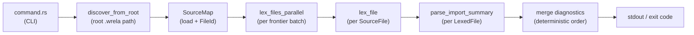

# Compiler pipeline (current)

How the implemented command-center phases connect today. Later phases (parse,
check, codegen) will extend this graph; they are not implemented yet.



## Phase responsibilities

| Module | Input | Output | Notes |
|--------|-------|--------|-------|
| `source` | file paths | `SourceFile`, `SourceMap`, `Span` | UTF-8 text + line starts; insertion-order `FileId` |
| `discover` | root path | `DiscoverResult` | `VecDeque` frontier, canonical de-dupe, parallel batches |
| `lexer` | `&SourceFile` | `LexedFile` | Tokens + trivia with byte spans; no mode flag |
| `syntax::imports` | `LexedFile` + `SourceFile` | `ImportSummary` | Minimal `use { } from module.path` parse only |
| `diagnostic` | — | `Diagnostic` | Phases accumulate; CLI renders |
| `command` | argv | process exit code | Only layer that writes user output |

## Discovery loop

1. Canonicalize and load the root image file.
2. Lex the current frontier batch in parallel (`std::thread::scope`).
3. Parse import summaries; resolve dotted paths to `.wrela` files under the source root.
4. Enqueue unseen canonical paths; repeat until the frontier is empty.
5. Expose merged diagnostics sorted by `FileId`, then source order within each file.

## Public API (today)

```rust
pub fn lexer::lex_file(source: &SourceFile) -> LexedFile;
pub fn lexer::lex_files_parallel(files: &[SourceFile]) -> Vec<LexedFile>;
pub fn syntax::imports::parse_import_summary(lexed: &LexedFile, source: &SourceFile) -> ImportSummary;
pub fn discover::discover_from_root(root: impl AsRef<Path>) -> DiscoverResult;
```

## CLI commands (today)

| Command | Phases exercised |
|---------|------------------|
| `wrela dump tokens <file>` | load → lex → print |
| `wrela lex <root.wrela>` | discover → lex all reachable → summarize |

See [`supported-wrela-subset.md`](supported-wrela-subset.md) for syntax the toolchain accepts today.
