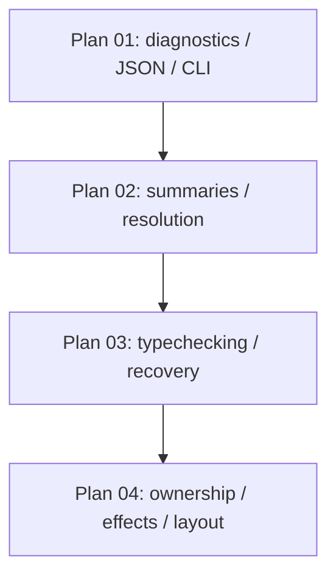

# Check And Diagnostics Implementation Plan

> **For agentic workers:** REQUIRED SUB-SKILL: Use `superpowers:subagent-driven-development` (recommended) or `superpowers:executing-plans` to implement this plan task-by-task. Steps use checkbox (`- [ ]`) syntax for tracking.

**Goal:** Deliver `wrela check` as Wrela's first semantic product surface: stable JSON diagnostics by default, rich human diagnostics on request, and a staged path through summaries, resolution, type checking, ownership, effects, and layout checks.

**Architecture:** This is a parent roadmap. The original single-plan shape was too broad to be junior-executable and overstated parallelism, so the work is split into four production plans with clear dependencies and file ownership. Each child plan produces working, testable software on its own and preserves the public `wrela check <root.wrela>` contract.

**Tech Stack:** Rust 2024, standard library only, existing Wrela lexer/parser/discovery modules, handwritten JSON rendering.

---

## Product Contract

`wrela check <root.wrela>` is read-only and emits JSON by default.

```text
wrela check <root.wrela>          # JSON, default
wrela check --json <root.wrela>   # JSON, explicit
wrela check --human <root.wrela>  # rich text diagnostics
```

Exit behavior:

- `0` when no error-severity diagnostics are produced
- `1` when lex, parse, resolve, type, ownership, effect, layout, or internal check diagnostics include an error
- `2` for malformed CLI usage, matching the existing command style

Formatting is not part of `check`. MIR lowering is not part of this scope and must not depend on canonical source text.

## Child Plans

| Order | Plan | Responsibility | Depends On |
|-------|------|----------------|------------|
| 1 | [Check 01: Diagnostics, JSON, And CLI](2026-05-25-check-01-diagnostics-json-cli.md) | Diagnostic data model, source locations/hashes, parse diagnostic codes, `wrela check` skeleton, JSON default, human renderer | Parser already merged |
| 2 | [Check 02: Semantic Summaries And Resolution](2026-05-25-check-02-summaries-resolution.md) | CST traversal helpers, owned semantic summaries, module graph, exports, imports, duplicate and wrong-kind name diagnostics, name suggestions | Plan 01 |
| 3 | [Check 03: Typechecking And Recovery](2026-05-25-check-03-typechecking-recovery.md) | Type model, signature validation, expression/body checking, unknown facts, cascade suppression, suggested fixes | Plan 02 |
| 4 | [Check 04: Ownership, Effects, Layout, And Final Product Bar](2026-05-25-check-04-ownership-effects-layout.md) | Access/move checks, effect facts, layout legality, final diagnostic examples, documentation, Phase A handoff | Plan 03 |

This is intentionally mostly sequential. Parallelism exists inside child plans only where file ownership and dependencies make it real. No section may claim parallel work unless it names the owned files and predecessor tasks.

## Subagent Verification Discipline

Subagents may run focused verification for the task they own, with a timeout set in the execution tool. Recommended timeout: 120 seconds for focused `cargo test`/CLI commands and 300 seconds for orchestrator-only quality gates. Examples:

```bash
cargo test --test check check_default_json_is_machine_readable
cargo test diagnostic_codes_are_stable
cargo test --test check check_reports_duplicate_top_level_names
```

Subagents must not run the full quality gate, strict clean gates, broad stress commands, or unbounded watch/server processes. The orchestrator runs these sequentially after each returned task branch is reviewed:

```bash
./scripts/quality-gate.sh
```

Before final merge, the orchestrator also runs strict mode:

```bash
QUALITY_GATE_STRICT_CLEAN=1 ./scripts/quality-gate.sh
```

`./scripts/quality-gate.sh` is the local CI substitute. It formats, checks, runs clippy, runs tests, and scans for forbidden production markers. Strict mode additionally requires a clean git status.

## Review Workflow

Phase A is the required thermo-nuclear self-review before user handoff. The orchestrator runs the repository review workflow described in `docs/implementation/reviews/README.md`, records an APPROVED verdict on disk, and fixes every finding at every priority unless the verdict documents an explicit technical disagreement.

After user feedback, the orchestrator fixes every suggestion at every severity, including maintenance smells and comments labeled optional, deferred, or non-blocking, unless the final verdict documents an explicit technical disagreement.

The orchestrator does not run automated Phase B review unless the user asks.

The four child plans are subplans under this one parent delivery. Run Phase A once after Plan 04 when delivering the whole `check` product. If a child plan is delivered to the user independently, that child delivery must run Phase A before handoff.

## Cross-Plan Decisions

- JSON is the default `check` renderer. `--json` is an explicit alias, not a separate behavior.
- Human rendering stays available through `--human`.
- Only `command.rs` writes user-facing output.
- Compiler phases return diagnostics as data.
- Diagnostic codes are owned by `docs/design/diagnostic-codes.md`.
- Every diagnostic with a source location has a primary span.
- Secondary spans, related locations, notes, help, and suggested fixes are structured data.
- Suggested fixes carry applicability and source-hash preconditions.
- Overlapping suggested-fix edits are not merged automatically. A diagnostic may include multiple edits only when their spans are disjoint and sorted by `(file_id, start, end)`.
- Repeated unknown references in the same scope are grouped by `(scope_id, name_text)`: one root diagnostic, later uses as related locations. This intentionally replaces the earlier source-span dedup idea.
- `SyntaxErrorKind::ExpectedType` maps to a parse-phase code named `W-PARSE-EXPECTED-TYPE`, not a type-phase code.
- `SourceFile` and `SourceMap` derive `Clone` so `CheckResult` can own the source map after discovery. This is an explicit V1 ownership choice.
- Checker semantic summaries use `CheckModuleSummary` and `CheckImportSummary` to avoid collisions with the existing parser/debug summaries exported from `syntax::lower` and `syntax::imports`.
- The first checker supports a defined body subset. Parsed constructs outside that subset emit explicit unsupported semantic diagnostics; unchecked code must not silently pass.
- Fixtures used by earlier plans must remain valid under later ownership checks. The stable smoke fixture passes bytes by read access and never moves a value that is used again.

## Dependency Graph



## Final Acceptance Criteria

- `wrela check <root.wrela>` emits `schema: "wrela.check.v1"` JSON by default.
- `wrela check --human <root.wrela>` emits rich source diagnostics.
- Valid code exits `0`; invalid semantic code exits `1`; malformed command usage exits `2`.
- The checker discovers reachable modules from the root and checks all independent modules it can trust after recovery.
- Diagnostic recovery keeps collecting useful independent diagnostics after lex, parse, summary, resolution, type, ownership, effect, and layout failures.
- Unknown-name cascades produce one root diagnostic per `(scope_id, name_text)` and suppress derivative type mismatch noise.
- Suggested fixes include exact source edits, applicability, source hashes, and disjoint-span validation.
- `./scripts/quality-gate.sh` passes after every child plan.
- `QUALITY_GATE_STRICT_CLEAN=1 ./scripts/quality-gate.sh` passes before merge.
- Phase A review is APPROVED on disk before user handoff.

## Execution Notes

Each child plan contains atomic tasks with code examples and focused acceptance criteria. A junior engineer should be assigned one child-plan task at a time, not this parent roadmap as an implementation ticket.
